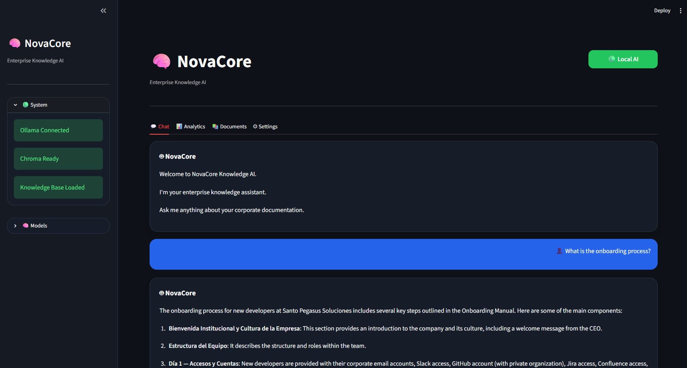
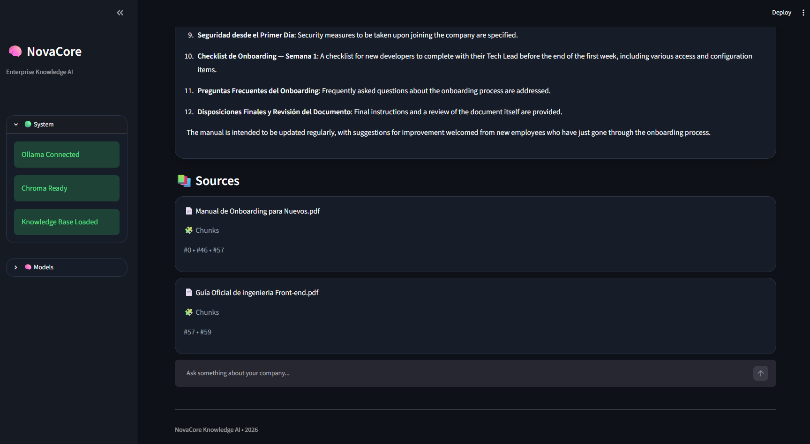
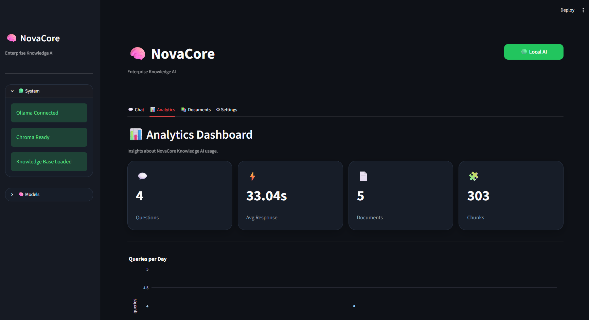
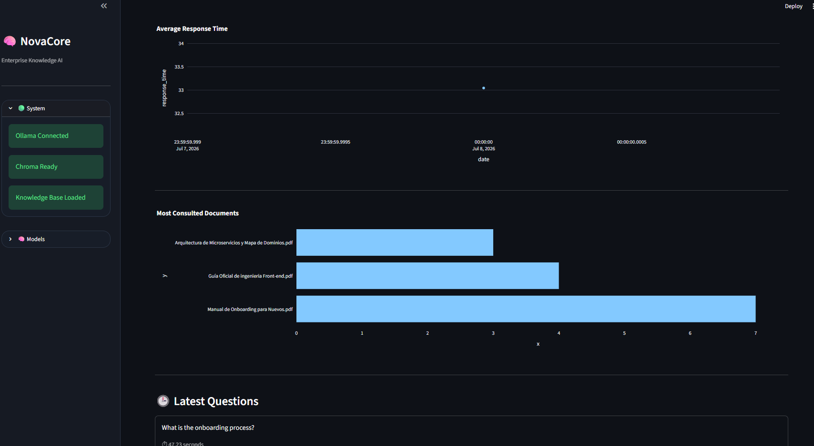
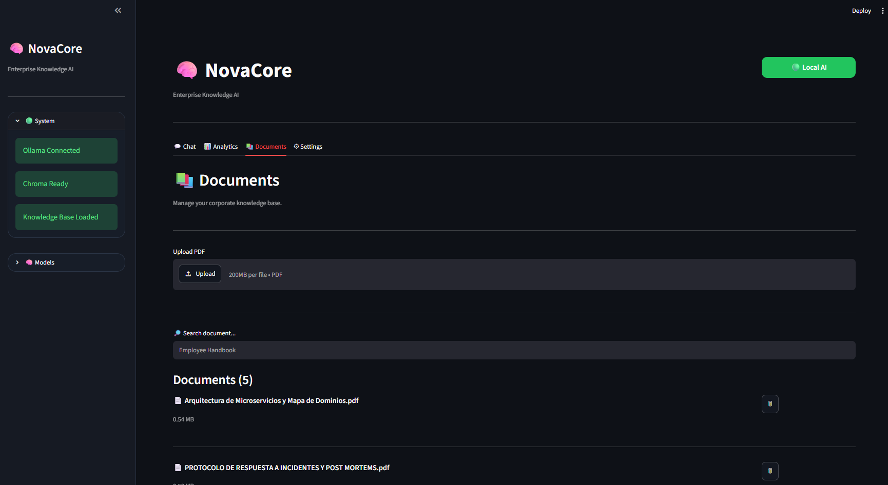

# 🧠 NovaCore Knowledge AI
## Demo

NovaCore allows users to:

- Upload corporate PDF documents
- Automatically process and index content
- Search documents using semantic retrieval
- Ask natural language questions
- Receive grounded answers generated by a local LLM
- View the original document sources used to answer each question
- Monitor application analytics
- Manage the enterprise knowledge base

> Enterprise Knowledge Assistant powered by Local AI (Ollama + ChromaDB)


---

## 📖 Overview

NovaCore Knowledge AI is an enterprise Retrieval-Augmented Generation (RAG) application that answers questions using private corporate documentation.

Instead of relying on public internet information, NovaCore retrieves relevant content from an internal knowledge base stored in ChromaDB and generates grounded responses using a fully local Large Language Model running on Ollama.

The project demonstrates how to build a secure AI knowledge assistant without sending sensitive information to external AI providers.

---

# 🎯 Challenge Objective

This project was developed as part of the **Oracle Next Education (ONE) + Alura AI Challenge**.

The goal was to build an intelligent agent capable of:

- Reading corporate documents (PDF)
- Processing and indexing information
- Answering natural language questions
- Using Retrieval-Augmented Generation (RAG)
- Running completely locally

---

# ✨ Features

- 📄 PDF document ingestion
- 📚 Automatic document processing
- ✂️ Intelligent text chunking
- 🧠 Local embeddings using Ollama
- 🔎 Semantic search with ChromaDB
- 🤖 Local LLM inference (Qwen 2.5)
- 💬 Interactive Streamlit chat interface
- 📊 Analytics dashboard
- 📂 Document management
- 📚 Source attribution for every response
- 🔒 100% Local AI (No OpenAI API required)

---

# 🏛 Solution Architecture

```text
                 +-----------------------+
                 | Corporate Documents   |
                 +-----------+-----------+
                             |
                             v
                  +----------------------+
                  |      PDF Loader      |
                  +----------------------+
                             |
                             v
                  +----------------------+
                  | Document Processor   |
                  +----------------------+
                             |
                             v
                  +----------------------+
                  |   Text Chunking      |
                  +----------------------+
                             |
                             v
                  +----------------------+
                  | Embeddings           |
                  | nomic-embed-text     |
                  +----------------------+
                             |
                             v
                  +----------------------+
                  | ChromaDB Vector DB   |
                  +----------------------+
                             |
                             v
                  +----------------------+
                  | Semantic Retriever   |
                  +----------------------+
                             |
                             v
                  +----------------------+
                  | Qwen 2.5 (Ollama)    |
                  +----------------------+
                             |
                             v
                  +----------------------+
                  | Streamlit Interface  |
                  +----------------------+
```

---

# 📂 Project Structure

```text
corporate-knowledge-ai/

│
├── app/
│   ├── config/          # Application configuration and environment settings
│   ├── llm/             # Local LLM (Ollama) integration
│   ├── loaders/         # PDF and CSV document loaders
│   ├── models/          # Data models and response schemas
│   ├── processors/      # Document preprocessing pipeline
│   ├── prompts/         # Prompt templates
│   ├── rag/             # Retrieval-Augmented Generation pipeline
│   ├── services/        # Business logic and application services
│   ├── ui/              # Streamlit interface and reusable UI components
│   ├── utils/           # Helper utilities
│   └── vectorstore/     # ChromaDB vector database integration
│
├── assets/              # README images and project screenshots
│
├── data/
│   ├── logs/            # Analytics and query logs
│   ├── processed/       # Processed documents
│   ├── raw/             # Original uploaded documents
│   └── vector_db/       # ChromaDB persistent storage
│
├── docs/                # Additional documentation
├── tests/               # Unit tests
│
├── Dockerfile           # Docker image definition
├── docker-compose.yml   # Docker Compose configuration
├── index.py             # Document indexing entry point
├── main.py              # CLI execution entry point
├── streamlit_app.py     # Streamlit application
├── requirements.txt     # Python dependencies
└── README.md            # Project documentation
```
The project follows a modular architecture where each package has a single responsibility, making the application easy to maintain, extend and test.
---

# 🛠 Tech Stack

- Python 3.12
- Streamlit
- LangChain
- Ollama
- ChromaDB
- PyPDF
- Pandas
- Docker

---

# ⚙ Installation

## 1. Clone the repository

```bash
git clone https://github.com/gabriel1005-hub/corporate-knowledge-ai-agent.git
```

## 2. Navigate to the project

```bash
cd corporate-knowledge-ai-agent
```

## 3. Create a virtual environment

```bash
python -m venv .venv
```

## 4. Activate the environment

### Windows

```bash
.venv\Scripts\activate
```

### Linux / macOS

```bash
source .venv/bin/activate
```

## 5. Install dependencies

```bash
pip install -r requirements.txt
```

---

# 🦙 Install Ollama

Download Ollama:

https://ollama.com/download

Install the required models:

```bash
ollama pull nomic-embed-text

ollama pull qwen2.5:3b
```

---

# 🚀 Running the Application

## Index your documents

```bash
python index.py
```

## Launch the application

```bash
streamlit run streamlit_app.py
```

Open your browser:

```
http://localhost:8501
```

---

# 💬 Example Questions

NovaCore can answer questions such as:

- What is the onboarding process??
- Summarize the employee handbook.
- What cybersecurity policies exist?
- Explain the onboarding process.
- What employee benefits are available?
- What does this PDF say about remote work?
- Summarize this document.
- Which departments are mentioned in the document?

---

# 🤖 Example Response

**Question**

> What is the onboarding process?

**Answer**

According to the Employee Handbook, employees are entitled to paid annual vacation after completing one year of continuous employment. Vacation requests must be submitted through the HR platform and require manager approval.

**Sources**

- Employee Handbook.pdf
- Chunk #12

---

# 📊 Application Modules

NovaCore includes four main modules:

### 💬 Chat

Interact naturally with your corporate knowledge base.

### 📊 Analytics

View application usage metrics and response statistics.

### 📚 Documents

Manage indexed documents.

Upload new PDFs.

Delete indexed files.

Monitor the knowledge base.

### ⚙ Settings

Reserved for future configuration options.

---

# 📸 Screenshots

## 💬 Chat Interface



Natural language conversations with the enterprise knowledge base.

---

## 📚 Response with Sources



Every answer includes the original document sources used during retrieval.
---

## 📊 Analytics Dashboard



Application usage statistics.



Most consulted documents and latest questions.
---
## Documents




---

# 🔒 Privacy

NovaCore runs **100% locally**.

No corporate documentation is sent to external AI providers.

All document processing, embedding generation, retrieval and inference are executed on the local machine.

---

# ☁️ Deployment

The application has been deployed on Oracle Cloud Infrastructure (OCI).

Public URL:

https://xxxxxxxxxxxxx

Deployment Evidence

- Public URL
- Running application
- Accessible through any modern web browser

---

## 🐳 Docker

Docker configuration is included in this repository.

Native execution is currently recommended while container compatibility with the local vector database is being finalized.

---

# 🚀 Future Improvements

- Oracle Cloud deployment
- Docker optimization
- Conversation history
- Multiple document collections
- Additional document formats (CSV, DOCX)
- User authentication

---

# 👨‍💻 Author

**Gabriel Garcia**

Data Analyst | AI & Analytics

GitHub:

https://github.com/gabriel1005-hub

LinkedIn:

www.linkedin.com/in/gabriel-andres-garcia-mendoza-257067168

---

# 🙏 Acknowledgements

This project was developed as part of the **Oracle Next Education (ONE)** program in partnership with **Alura Latam**.

Special thanks to Oracle and Alura for promoting practical learning in Artificial Intelligence and Software Development.

---
