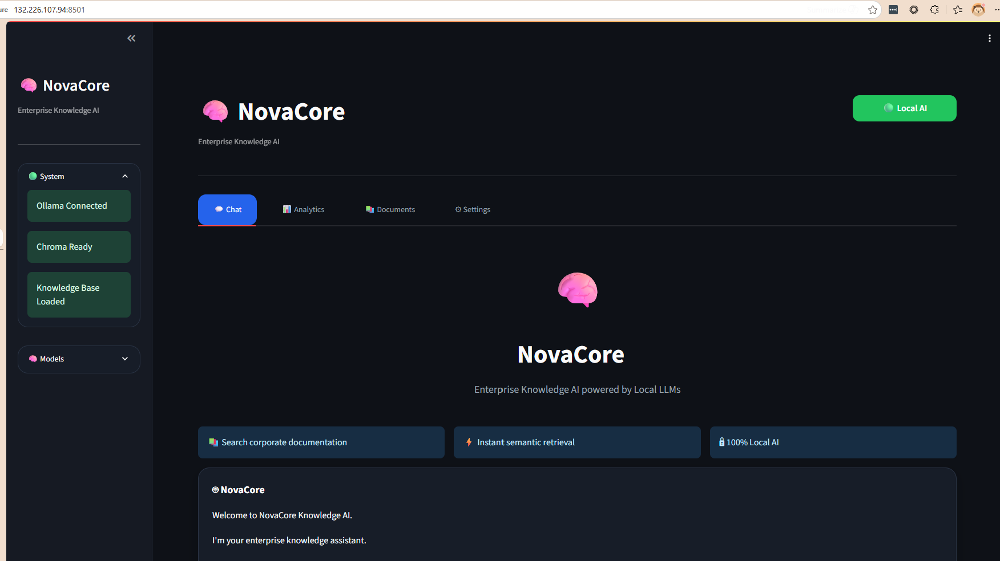

# 🧠 NovaCore – Enterprise Knowledge AI

<p align="center">


</p>

Enterprise Retrieval-Augmented Generation (RAG) assistant powered entirely by **Local LLMs**.

NovaCore allows organizations to securely query internal documentation using natural language while keeping all AI inference on their own infrastructure.

Developed for the **Oracle Next Education (ONE) + Alura Latam AI Challenge**.

---

# 🚀 Live Demo

**Oracle Cloud Infrastructure Deployment**

```
http://132.226.107.94:8501
```

---

# 🎥 Demo

> Replace this image with your GIF.


---

# 📸 Screenshots

## Home



---

## Chat


---

## Analytics


---

## Documents


---

# ✨ Features

- Enterprise RAG architecture
- Local LLM inference using Ollama
- Local vector database with ChromaDB
- Semantic document search
- PDF indexing pipeline
- Retrieval analytics
- Document management
- Docker support
- Oracle Cloud deployment
- Fully local AI (no OpenAI APIs)

---

# 📊 Project Highlights

| Metric | Value |
|----------|--------|
| Documents Indexed | 5 |
| Vector Embeddings | 303 |
| Vector Database | ChromaDB |
| LLM | Qwen2.5 3B |
| Embedding Model | nomic-embed-text |
| Deployment | Oracle Cloud Infrastructure |
| Frontend | Streamlit |
| AI Execution | 100% Local |

---

# 🧠 Architecture

```
                    User

                      │

                      ▼

              Streamlit Interface

                      │

                      ▼

                Query Service

                      │

          ┌───────────┴────────────┐

          ▼                        ▼

    Retriever                 Conversation

          │

          ▼

      ChromaDB

          │

          ▼

Relevant Chunks Retrieved

          │

          ▼

 Prompt Builder

          │

          ▼

   Ollama (Qwen2.5)

          │

          ▼

     Final Response
```

---

# 🔄 RAG Pipeline

```
Question

↓

Embedding Generation

↓

Vector Similarity Search

↓

Top-K Retrieval

↓

Prompt Construction

↓

Local LLM (Qwen2.5)

↓

Grounded Response
```

---

# 🧱 AI Stack

| Component | Technology |
|------------|------------|
| LLM | Qwen2.5 3B |
| Embeddings | nomic-embed-text |
| Framework | LangChain |
| Vector Database | ChromaDB |
| UI | Streamlit |
| Containerization | Docker |
| Deployment | Oracle Cloud Infrastructure |
| Language | Python 3.12 |

---

# 📂 Project Structure

```
app/

    config/

    llm/

    rag/

    services/

    vectorstore/

    ui/

data/

    raw/

    vector_db/

    logs/

assets/

streamlit_app.py

index.py

Dockerfile

docker-compose.yml
```

---

# ⚙️ Installation

## Clone repository

```bash
git clone https://github.com/gabriel1005-hub/corporate-knowledge-ai-agent.git

cd corporate-knowledge-ai-agent
```

---

## Create virtual environment

```bash
python -m venv .venv
```

Activate

Windows

```bash
.venv\Scripts\activate
```

Linux

```bash
source .venv/bin/activate
```

---

## Install dependencies

```bash
pip install -r requirements.txt
```

---

## Install Ollama

```bash
curl -fsSL https://ollama.com/install.sh | sh
```

---

## Download models

```bash
ollama pull qwen2.5:3b

ollama pull nomic-embed-text
```

---

## Index the documents

```bash
python index.py
```

---

## Launch

```bash
streamlit run streamlit_app.py
```

---

# 🐳 Docker

Build

```bash
docker compose build
```

Run

```bash
docker compose up
```

Application

```
http://localhost:8501
```

---

# ☁️ Oracle Cloud Deployment

NovaCore is deployed on an **Oracle Cloud Infrastructure Compute Instance**.

Deployment includes:

- Docker
- Streamlit
- Ollama
- ChromaDB
- Local AI Models

Example deployment:


---

# 💬 Example Questions

- What is the onboarding process?
- Explain the Front-end engineering guidelines.
- What is the incident response protocol?
- Describe the microservices architecture.
- What responsibilities does the Back-end engineering guide define?

---

# 🤖 Example Response

**Question**

```
What is the onboarding process?
```

**Answer**

```
The onboarding process begins with account provisioning,
repository access, environment setup, mandatory security
training and team introduction during the employee's first week.
```

**Source**

```
Manual de Onboarding para Nuevos.pdf

Chunk 41
```

---

# 📚 Technologies

- Python

- LangChain

- ChromaDB

- Ollama

- Streamlit

- Docker

- Pandas

- PyPDF

- Plotly

---

# 🔒 Privacy

NovaCore executes every AI operation locally.

No document content is sent to external AI providers.

This makes the solution suitable for enterprise knowledge bases containing sensitive documentation.

---

# 🚀 Future Improvements

- Hybrid Retrieval (BM25 + Vector Search)
- Multi-document citations
- Conversation memory
- User authentication
- CSV support
- Microsoft Office document support
- Streaming responses
- Feedback evaluation
- Automatic document synchronization
- Role-based access control

---

# 👨‍💻 Author

**Gabriel Andrés García Mendoza**

Data Analyst | AI Engineer

GitHub

https://github.com/gabriel1005-hub

LinkedIn

https://linkedin.com/in/gabriel-andres-garcia-mendoza-257067168

---

# 🙏 Acknowledgements

Developed as part of the

**Oracle Next Education (ONE)**

and

**Alura Latam AI Challenge**

using Local AI technologies including Ollama, LangChain and ChromaDB.

---

# ⭐ If you like this project...

Give it a ⭐ on GitHub!